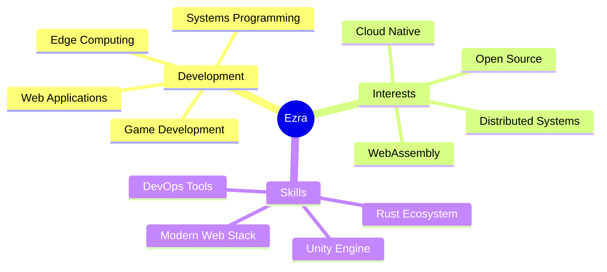

# 👋 Hello, I'm Ezra Valen Ne Tofa

### 🚀 Software Developer | 🎮 Game Programmer | 💻 Systems Engineer

---

## 🌟 About Me

<table>
<tr>
<td width="50%" valign="top">

I'm a **passionate software developer** specializing in **high-performance systems** and **creative game development**. With experience spanning from low-level systems programming to immersive game experiences, I focus on building innovative solutions that push technical boundaries.

</td>
<td width="50%" valign="top">

</td>
</tr>
</table>

---

## 🎯 Featured Projects

### 🔷 Aether Edge Computing Framework

  

**High-performance edge computing platform with WebAssembly runtime**

Deploy serverless WASM functions to distributed edge nodes with sub-millisecond latency. Built with Rust for maximum performance, featuring automatic orchestration and sandboxed execution environments.

<table>
<tr>
<td width="50%" valign="top">

**🎯 Core Features**
- ⚡ Sub-5ms cold starts
- 🔒 Sandboxed WASM execution
- 🌐 Automatic node coordination
- 📊 10k+ requests/second throughput
- 🛡️ WASI isolation per function
- 🔄 Smart module caching

</td>
<td width="50%" valign="top">

**🛠️ Technology Stack**
- **Runtime:** Rust, WebAssembly, WASI
- **Async:** Tokio, async-std
- **Storage:** Sled DB
- **Networking:** Actix-web
- **Deployment:** Docker, Kubernetes-ready

</td>
</tr>
</table>

---

### 🎮 The Haunted Toyshop

  

**Horror puzzle adventure game built with Unity Engine**

An atmospheric horror puzzle game featuring challenging gameplay mechanics and immersive environments. Developed as part of Group-4 collaboration, showcasing teamwork and creative problem-solving in game development.

<table>
<tr>
<td width="50%" valign="top">

**🎨 Game Features**
- 🌙 Atmospheric horror aesthetics
- 🧩 Complex puzzle mechanics
- 🎵 Immersive sound design
- 🎭 Engaging storyline
- 🏆 Achievement system
- 🎮 Intuitive controls

</td>
<td width="50%" valign="top">

**👥 Development Team**
- **Programmer:** Ezra Valen Ne Tofa
- **Designer:** Herdy Hardiyant
- **Sound & Assets:** Punto Putra
- **Platform:** Windows Desktop
- **Engine:** Unity 3D with C#

</td>
</tr>
</table>

---

## 💻 Tech Stack & Tools

<table>
<tr>
<td width="50%" valign="top">

### 🔤 Programming Languages

### 🛠️ Frameworks & Libraries

### 🗄️ Databases & Storage

</td>
<td width="50%" valign="top">

### ⚙️ Tools & Platforms

### 🌐 Web Technologies

### 📋 Development Practices

</td>
</tr>
</table>

---

## 📊 GitHub Analytics

<table>
<tr>
<td width="50%" valign="top">

 

</td>
<td width="50%" valign="top">

 

</td>
</tr>
</table>

 

---

## 🎨 What I Bring to the Table

<table>
<tr>
<td align="center" width="25%">

  
<b>Clean Architecture</b>
  
Writing maintainable, scalable, and well-documented code following industry best practices
</td>
<td align="center" width="25%">

  
<b>Performance Optimization</b>
  
Building high-performance systems with focus on speed, efficiency, and resource management
</td>
<td align="center" width="25%">

  
<b>Team Collaboration</b>
  
Effective communication and agile methodologies in cross-functional team environments
</td>
<td align="center" width="25%">

  
<b>Problem Solving</b>
  
Creative solutions to complex technical challenges with innovative approaches
</td>
</tr>
</table>

---

## 🏆 Achievements & Interests

---

## 📈 Contribution Activity

---

## 💬 Let's Connect & Collaborate

I'm always excited to work on **innovative projects** and discuss **cutting-edge technologies**. Whether you're building distributed systems, developing games, or exploring new tech stacks, let's connect!
 

---

### 🌈 Thanks for Visiting My Profile!

  

> *"The best way to predict the future is to invent it."* - Alan Kay

 

**⭐ If you find my work interesting, consider starring my repositories!**

 

