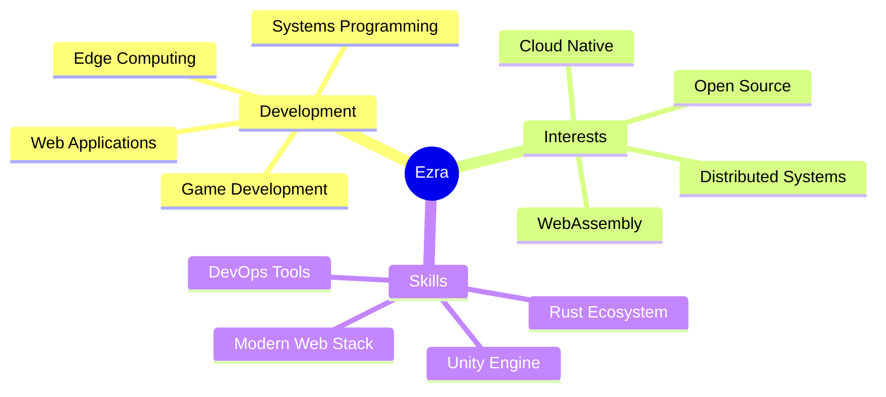

<div align="center">
  


# 👋 Hello, I'm Ezra Valen Ne Tofa

### 🚀 Software Developer | 🎮 Game Programmer | 💻 Systems Engineer

[](https://www.linkedin.com/in/ezra-tofa-68843228a/)
[](mailto:officialbangezz@gmail.com)
[](https://pikaruo.itch.io/the-haunted-toyshop)
[](https://github.com/ezvalorazetho)

</div>

---

## 🌟 About Me


```typescript
const ezra = {
    name: "Ezra Valen Ne Tofa",
    alias: "Exzgit",
    role: "Full-Stack Developer",
    location: "🌏 Indonesia",
    workingOn: "Edge Computing & Game Development",
    expertise: [
        "Systems Programming",
        "Game Development",
        "Web Applications",
        "Distributed Systems"
    ],
    learning: ["WebAssembly", "Cloud Native"],
    philosophy: "Code with purpose, build with passion"
};
```

I'm a **passionate software developer** specializing in **high-performance systems** and **creative game development**. With experience spanning from low-level systems programming to immersive game experiences, I focus on building innovative solutions that push technical boundaries. Currently exploring edge computing architectures and real-time distributed systems.

<br clear="right"/>

---

## 🎯 Featured Projects

<table>
<tr>
<td width="50%">

### 🔷 Aether Edge Computing Framework

**High-performance edge computing platform with WebAssembly runtime**

Deploy serverless WASM functions to distributed edge nodes with sub-millisecond latency. Built with Rust for maximum performance, featuring automatic orchestration and sandboxed execution environments.

**Technologies:** `Rust` `WebAssembly` `WASI` `Tokio` `Distributed Systems`

**Highlights:**
- ⚡ Sub-5ms cold starts
- 🔒 Sandboxed WASM execution
- 🌐 Automatic node coordination
- 📊 10k+ req/s throughput

[](https://github.com/ezvalorazetho/aether-edge)
[](https://crates.io/crates/aether-edge)

</td>
<td width="50%">

### 🎮 The Haunted Toyshop

**Horror puzzle adventure game built with Unity**

An atmospheric horror puzzle game featuring challenging gameplay mechanics and immersive environments. Developed as part of Group-4 collaboration, showcasing teamwork and creative problem-solving in game development.

**Technologies:** `Unity` `C#` `Game Design` `Windows`

**Highlights:**
- 🎨 Atmospheric horror aesthetics
- 🧩 Complex puzzle mechanics
- 🎵 Immersive sound design
- 👥 Collaborative development

[](https://pikaruo.itch.io/the-haunted-toyshop)

</td>
</tr>
</table>

---

## 💻 Tech Stack & Tools

<div align="center">

### 🔤 Languages


### 🛠️ Frameworks & Libraries


### 🗄️ Databases & Storage


### ⚙️ Tools & Platforms


### 📋 Methodologies


</div>

---

## 📊 GitHub Analytics

<div align="center">
  


<br><br>


</div>

---

## 🎨 What I Bring to the Table

<div align="center">

<table>
<tr>
<td align="center" width="25%">

<br><br>
<b>Clean Architecture</b>
<br><br>
<sub>Writing maintainable, scalable, and well-documented code following industry best practices</sub>
</td>
<td align="center" width="25%">

<br><br>
<b>Performance Optimization</b>
<br><br>
<sub>Building high-performance systems with focus on speed, efficiency, and resource management</sub>
</td>
<td align="center" width="25%">

<br><br>
<b>Team Collaboration</b>
<br><br>
<sub>Effective communication and agile methodologies in cross-functional team environments</sub>
</td>
<td align="center" width="25%">

<br><br>
<b>Problem Solving</b>
<br><br>
<sub>Creative solutions to complex technical challenges with innovative approaches</sub>
</td>
</tr>
</table>

</div>

---

## 🏆 Achievements & Interests

<div align="center">



</div>

---

## 📈 Contribution Activity

<div align="center">

[](https://github.com/exzgit)

</div>

---

## 💬 Let's Connect & Collaborate

<div align="center">

I'm always excited to work on **innovative projects** and discuss **cutting-edge technologies**. Whether you're building distributed systems, developing games, or exploring new tech stacks, let's connect!

### 📫 Reach Out

<table>
<tr>
<td align="center" width="33%">
<a href="https://www.linkedin.com/in
